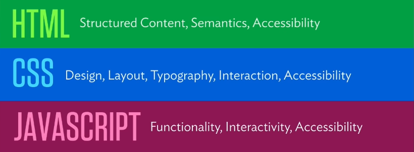

Welcome to the first official blog series that I'm doing to practice writing guides/tutorials.

  * Who this guide is for: complete beginners and practicing developers.
  * Who this guide is NOT for: intermidiate or advanced devs.

This is my "Baby steps to getting going doing front-end web development for beginners by a beginner". I'm not some
tech-speaker guy who made insane OSS projects or an advocate for a large tech firm. I'm a junior dev who a few months
ago got his first ever job and I want to share some tips on how I got there, so that maybe you can get your feet off
the ground and make some stuff.

This series will have 3 parts: **Part 1: Resources to learn**, **Part 2: Making and hosting projects** and
**Part 3: Advice for job searching**

##WELCOME TO PART 1!###
The core things that you need for a front-end developer focused productivity are the holy trifecta of web dev: HTML, CSS
and JS. I won't go into too much detail about each language and technology. That's what the resources are for. But in my
own words:

* **HTML** is the skeleton and the whole reason why you can put things up on the screen in your browser. It serves
as the architecture and structure of your site or the content if you will.
* **CSS** is the styling component. Colors, fonts, positioning, size or things, animations etc. CSS does all of that and
so much more.
* **JS** is the interactivity component. This is the main thing you need to learn, the swiss army knife of web dev. If you
can learn JS you can learn anything. It is the programming language of the web.

---

There are also things that aren't really programming or development specific, but are necessary to be productive in todays
web dev world:

* **Chrome Dev Tools** is an essential tool for debugging, testing, checking and maintaining code. There will be resources to learn this
but you can only learn from articles and videos so much. Best way to really learn dev tools is to work on projects.
* **Git/Github** version control is also essential. I highly recommend [this](https://www.youtube.com/watch?v=SWYqp7iY_Tc) video
by Traversy Media explaining how to make a repo, add code, do commit messages and push to master. Do this first before
you do any projects or learning.
* **Markdown** this isn't a necessity but it's a useful tool to write README files on GitHub and maybe blogs like this one.
* **VSCode** you need an editor to write your code in. I recommend Visual Studio Code. If you need some help figuring out
how they work [this](https://www.youtube.com/watch?v=fnPhJHN0jTE) video will help.
* **Terminal/Console/CLI** knowing how to operate a console is essential. Almost everything you are going to be programming
will involve some use of a terminal. Use [this](https://youtu.be/Xm790AkFeK4) video and [this](https://www.learnenough.com/command-line-tutorial) guide to learn.

Right. So are you aren't overwhelmed already are you? If you are it's ok. I was overwhelmed and so was everyone else that had
to learn this stuff. Don't worry about learning everything all at once, learn just the things you NEED. For everything else,
Google is your best friend.

I also highly recommend [this](https://codingkilledthecat.wordpress.com/2012/06/26/how-to-ask-for-programming-help/)
guide on how to ask programming questions. And yes it's essential because you are going to be doing two things a lot:

* Asking questions
* Searching for answers

Learning how to do these is the most important skill you can learn right now. Ok enough fluff, let's get to the resources.

---

### HTML/CSS ###

These two are usually coupled together purely because you can't write CSS without HTML.

* Shay Howe has two amazing tutorials for HTML and CSS both for advanced and beginner topics. It is my go to recommendation
for people learning these two. You can find the guide [HERE](https://learn.shayhowe.com/). Do all the exercises, look at
the additional resources he provides, write code in your editor and push code to your repository. Don't use some online
editor, code on your own machine and save code to GitHub/GitLab. For references about HTML and CSS use [MDN](https://developer.mozilla.org/en-US/docs).

* After you finish the Shay Howe guides I recommend you do two things: **make your own website** and do **100 days of CSS**. To make
your own site you just need HTML and CSS. Make it ugly and messy, but finish it. Make it small. Use only things that are
necessary for showing who you are and what you do (introduction, what languages you know, experience and contact are good sections
to focus on). [100 Days Of CSS](https://100dayscss.com/) isn't recommended to do all the projects, just enough that you get good at CSS.
Do one project everytime you are bored or have an hour to kill.

* Learn [Bootstrap](https://getbootstrap.com/). This could easily be Foundation, Bulma, Semantic UI or no framework at all.
But Bootstrap is widely used to create websites faster. Redesign your personal site with Bootstrap. If you get stuck use the
official documentation or Google around. Teach yourself to know what you don't know.

[Follow me on Twitter](https://twitter.com/zasuh_).
[Github profile](https://github.com/zasuh).
[LinkedIn just because](https://www.linkedin.com/in/zasuhadolnik/).
